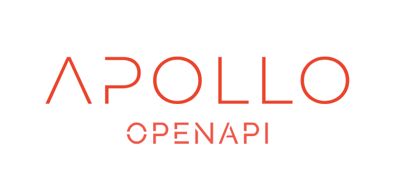

# 

Light OpenAPI parser library in PHP based on the [OpenAPI Specification](https://swagger.io/docs/specification/about/) allowing developers to extract easily schema's data.

## What can you do with it?

### Get Paths

In OpenAPI terms, paths are endpoints (resources), such as /users or /reports/summary/, that your API exposes.

All paths are relative to the API server URL.

```php
$openAPI = new OpenAPI();
$openAPI->getPaths();
/*
 * [
 *   '/articles',
 *   '/articles/{id}',
 *   '/images',
 *   ...
 * ]
 */
```

### Get Paths with Operations

In OpenAPI terms, paths are endpoints (resources),  such as /users or /reports/summary/, that your API exposes. 

Operations are the HTTP methods used to manipulate these paths, such as GET, POST or DELETE.

```php
$openAPI = new OpenAPI();
$openAPI->getPathsWithOperations();
/*
 * [
 *   '/articles' => [
 *     'get' => [...],
 *     'post' => [...],
 *   ],
 *   '/articles/{id}' => [
 *     'get' => [...],
 *   ],
 *   ...
 * ]
 */
```

### Get Path with Operations

Get a specific path (i.e endpoint) and return its operations.

```php
$openAPI = new OpenAPI();
$openAPI->getPathWithOperations('/articles');
/*
 * [
 *   'get' => [...],
 *   'post' => [...],
 * ]
 */
```

### Get the Request Body

The request body usually contains the representation of the resource to be created.

OpenAPI 3.0 provides the requestBody keyword to describe request bodies. 

> Request bodies are optional by default.

```php
$openAPI = new OpenAPI();
$operations = $openAPI->getPathWithOperations('/articles');
$openAPI->getRequestBody($operations['post']);
/*
 * [
 *   '$ref' => '#/components/requestBodies/ArticleBody',
 * ]
 */
```

### Get a Definition

OpenAPI 3.0 data types are based on an extended subset JSON Schema Specification Wright Draft 00.

The data types are described using a Schema object.

```php
$openAPI = new OpenAPI();
$openAPI->getDefinition('/articles', 'postArticle');
/*
 * [
 *   'type' => 'object',
 *   'required' => ['name', 'headline'],
 *   'additionalProperties' => false,
 *   'properties' => [
 *     'name' => ['type' => 'string'],
 *     'headline' => ['type' => 'string'],
 *     ...
 *   ]
 * ]
 */
```

### Example of Schema

```yaml
openapi: 3.0.0

servers:
  - url: 'https://api.apollo.dev:8091/'

info:
  version: "v1-oas3"
  title: Apollo API
  description: Share images and videos with your friends.
  termsOfService: terms
  license:
    name: MIT
    url: https://opensource.org/licenses/MIT

tags:
  - name: article
    description: Everything about articles

paths:
  /articles:
    get:
      tags:
        - article
      operationId: getArticles
      summary: ''
      description: Get a list of articles
      parameters:
        - name: fields[articles]
          in: query
          description: List of fields to display separated by a comma.
          example: "name,headline"
          required: false
          schema:
            type: string
        - name: sort
          in: query
          description: Field use to sort the result.
          example: "-name"
          required: false
          schema:
            type: string
        - name: page[offset]
          in: query
          description: Number of page to skip.
          required: false
          schema:
            type: integer
            default: 1
        - name: page[limit]
          in: query
          description: The numbers of items to return.
          required: false
          schema:
            type: integer
            default: 20
      responses:
        '200':
          description: Successful operation
          content:
            application/hal+json:
              schema:
                $ref: '#/components/schemas/Collection'
    post:
      tags:
        - article
      operationId: postArticle
      summary: ''
      description: Create a new article
      responses:
        '201':
          description: Successful operation
          content:
            application/hal+json:
              schema:
                $ref: '#/components/schemas/Article'
        '400':
          description: Bad request
      requestBody:
        $ref: '#/components/requestBodies/ArticleBody'

  /articles/{id}:
    get:
      tags:
        - article
      operationId: getArticle
      summary: ''
      description: Get a specific article
      parameters:
        - name: id
          in: path
          description: The id of the article
          required: true
          schema:
            type: string
      responses:
        '200':
          description: Successful operation
        '404':
          description: Article not found
    put:
      tags:
        - article
      summary: ''
      description: Update an existing article
      operationId: putArticle
      parameters:
        - name: id
          in: path
          description: The id of the article
          required: true
          schema:
            type: string
      responses:
        '200':
          description: Successful operation
          content:
            application/hal+json:
              schema:
                $ref: '#/components/schemas/Article'
        '400':
          description: Bad request
        '404':
          description: Article not found
      requestBody:
        $ref: '#/components/requestBodies/ArticleBody'
    delete:
      tags:
        - article
      summary: ''
      description: Delete a specific article
      operationId: deleteArticle
      parameters:
        - name: id
          in: path
          description: The id of the article
          required: true
          schema:
            type: string
      responses:
        '204':
          description: Article deleted
        '404':
          description: Article not found
          
components:
  schemas:
    ArticleBody:
      type: object
      required:
        - name
        - headline
        - article_body
        - author
      additionalProperties: false
      properties:
        name:
          type: string
          example: My first article
        headline:
          type: string
          description: Headline of the article.
          example: Traveling is great!
        article_body:
          type: string
          description: The actual body of the article.
          example: Traveling is great because...
        author:
          type: string
          description: The author of this content
          example: John Doe
        article_section:
          type: string
          example: discovery
          enum:
            - 'discovery'
            - 'travel'
            - 'update'
        tags:
          type: array
          items:
            type: string
            example: 'New York'

    Article:
      type: object
      properties:
        article:
          $ref: '#/components/schemas/ArticleBody'

    Collection:
      type: object
      properties:
        _links:
          type: object
        _embedded:
          type: object
          items:
            type: object

  requestBodies:
    ArticleBody:
      content:
        application/hal+json:
          schema:
            $ref: '#/components/schemas/ArticleBody'
      description: Article object.
      required: true
```